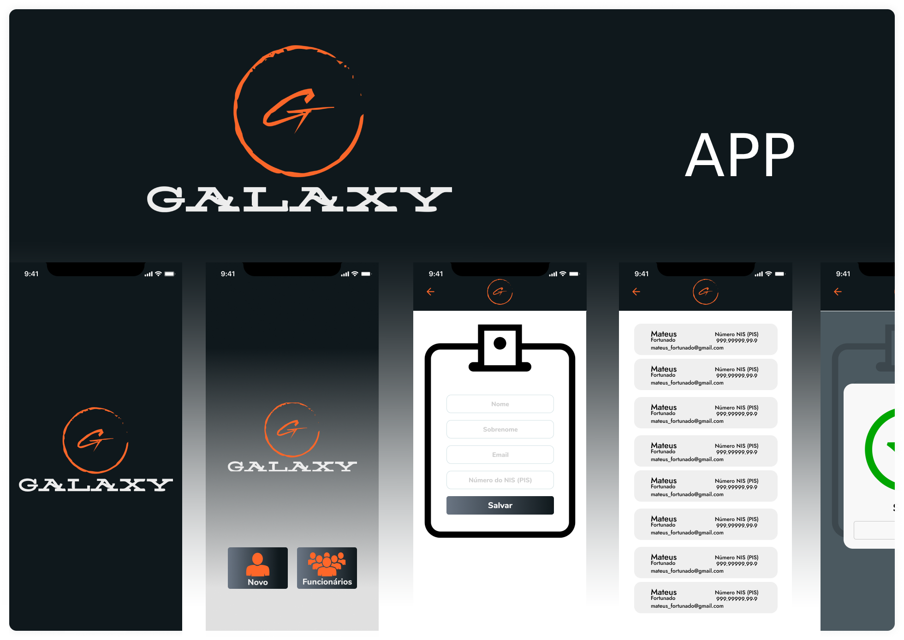

<h1 align="center">
  
</h1>

  

 

  

## ✨ Tecnologias

Esse projeto foi desenvolvido com as seguintes tecnologias:

- [React Native](https://reactnative.dev/)
- [Typescript](https://www.typescriptlang.org/)
- [Expo](https://expo.io/)

## 💻 Projeto

O aplicativo desenvolvido para realizar o cadastro de funcionários com seus principais dados, sendo (nome, sobrenome, email, número do NIS (PIS)).
Todos os dados salvos no aplicativo são mantido localmente.

Para realizar o downloado do app para android [clique aqui](https://drive.google.com/file/d/1_GoV8uHYMpeo44MDiSReNRutywoWLmXa/view?usp=sharing)

## 🚀 Como executar

- Baixe e instale seu dispositivo mobile o `Expo Go` obtido direto nas loja digital `PlayStore`.
- Clone o repositório
- Instale os recursos do `Expo-cli`
  > npm install --global expo-cli 
- Instale as dependências com `expo install`
- Inicie seu app com `expo start`

## 📄 Licença

Esse projeto está sob a licença MIT. Veja o arquivo [LICENSE](LICENSE.md) para mais detalhes.

